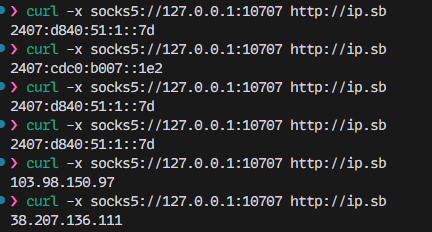

# airProxyPool 代��



用�“代�池�场景：把�������格�的节点统一�一个稳定的 SOCKS5 出�。适�爬虫�批�注册（注册机）�自动化任务等需�大�稳定出站代�的场景�

1) 通过 aggregator 自动扫�����用节�
2) 使用 glider 将节点统一转��SOCKS5 代�供外部访�
3) 自定义“机场�订阅一键转�为 glider �用�forward= 节点

- 普通用户：使用“白嫖机场�订阅作为代�池，开箱�用�
- 有追求用户：使用自建订阅或付费机场作为代�池，更干净�更���

## 功能特点

- 自动收集�定时更�
- �用性检测�故障转移
- 支� SS / VMess
- 统一�SOCKS5 访问��
- 支�自定义订阅（机场）→ glider 节点转�（�次或定时轮询�

## 目录
- [通用准备](#通用准备)
- [使用“白嫖机场�订阅作为代�池](#建议�白使用白嫖机场订阅作为代��
- [使用自建/付费订阅作为代�池](#有追求使用自建付费订阅作为代�池)

## 通用准备

- �赖�求
  - Python 3.7+
  - glider �执行文�

- 创建虚拟�境并安装��
```bash
python -m venv venv
pip install -r requirements.txt
```

- 安装 glider（下载�放置�
  - 将�执行文件放到项目 glider/ 目录�
    - Windows: glider/glider.exe（示例下载链�：v0.16.4 32-bit�
      https://github.com/nadoo/glider/releases/download/v0.16.4/glider_0.16.4_windows_386.zip
      解���命��glider.exe 放到 glider/ 目录
      验��`./glider/glider.exe -h`

    - macOS（示例，版本�以官方为准�
      ```bash
      # 示例：下载�缩包
      wget https://github.com/nadoo/glider/releases/download/v0.16.3/glider_0.16.3_macos_amd64.tar.gz
      # 解�（文件�以�际下载为准）
      tar -zxf glider_0.16.3_darwin_amd64.tar.gz
      # 移动到项目目录的 glider/
      mv glider_0.16.3_darwin_amd64 glider
      chmod +x glider/glider
      ```

    - Linux（示例，版本�以官方为准�

      ```bash
      wget https://github.com/nadoo/glider/releases/download/v0.16.3/glider_0.16.3_linux_amd64.tar.gz
      tar -zxf glider_0.16.3_linux_amd64.tar.gz
      mv glider_0.16.3_linux_amd64 glider
      chmod +x glider/glider
      ```
- glider 基础�置（glider/glider.conf）（此为示例，脚本会自行创建�
```conf
# Verbose mode, print logs
verbose=true

# 监�地�
listen=:10707

# 负载策略：rr（轮询）/ ha（高�用�
strategy=rr

# �康检�
check=http://www.msftconnecttest.com/connecttest.txt#expect=200

# �康检查间隔（秒）
checkinterval=30
```

---

## 使用“白嫖机场�订阅作为代�池

此方���aggregator（作�Git �模�），自动���费节点�

- �始�submodule（首次必�）
```bash
git submodule update --init --recursive
```
- 安装 aggregator �赖（在项目根）
```bash
pip install -r aggregator/requirements.txt
```
- 手动跑一轮采集并写入 glider/glider.conf �forward= �
```bash
python run_collector.py
```
- 守护�行（� 30 分钟刷新并��glider 生效�
```bash
python scheduler.py
```
- 默认 SOCKS5�27.0.0.1:10707
- 产物：aggregator/data/clash.yaml（��结�），glider/glider.conf（� forward= 行）


---

## 使用自建/付费订阅作为代��

此方��需�submodule（�忽略 aggregator）�
- 定时轮询（长期自动刷新）：在项目根创�subscriptions.txt（�行一个订�URL），然��行
```bash
python subscription_scheduler.py
```
- 行为：定时拉��解��forward= �写入 glider/glider.subscription.conf ��动/�� glider 使用该��
- 默认 SOCKS5/http�27.0.0.1:10710


## Star History

[](https://star-history.com/#dreammis/airProxyPool&Date)

---
## ��总览

- **aggregator**：`run_collector.py` / `scheduler.py` 调用 `aggregator/subscribe/collect.py` 拉�节点，输出 `aggregator/data/clash.yaml`。
- **parse.py**：将 clash 节点转�为 glider 的 `forward=` �置，并�并进 `glider.conf`。
- **glider**：�供统一 SOCKS5/HTTP 出�，由 `scheduler.py` 或 `subscription_scheduler.py` �动。
- **subscription_scheduler.py**：读�订阅 → 生� `glider.subscription.conf` → 测试节点 → 守护 glider。

链路关系：`aggregator → parse → glider（scheduler/subscription）`，采集�转��转�三段�确。

## Docker 部署

1. �建镜�并准备数��
   ```bash
   docker compose build
   mkdir -p data
   ```
2. 编辑 `subscriptions.txt`（宿主文件被容器绑定），`./data/glider` 用��久化 `glider.conf` � `glider.subscription.conf`。
3. 选择�动模�（命令=模�）
   ```bash
   docker compose up collector        # �次采集
   docker compose up -d scheduler     # 30 分钟轮询 + glider
   docker compose up -d subscription  # 订阅轮询 + glider
   ```
4. �境��（compose 内�覆盖）
   - `LISTEN_PORT`：glider 监�端�（默认 10707/10710）。
   - `STRATEGY`：glider 负载策略（默认 `rr`，亦� `ha`/`lha`）。
   - `CHECK_INTERVAL`：�康检查间隔（秒）。
   - `SCHEDULER_PORT`�`SUBSCRIPTION_PORT`：宿主机端�映射。
5. `scheduler` 默认开放 10707，`subscription` 默认开放 10710；改动�需在 compose 文件或 `docker compose run -e` 中覆盖。
6. VPS 上执行 `docker compose up -d <service>` ��，镜�已内置 Linux 版 glider。
